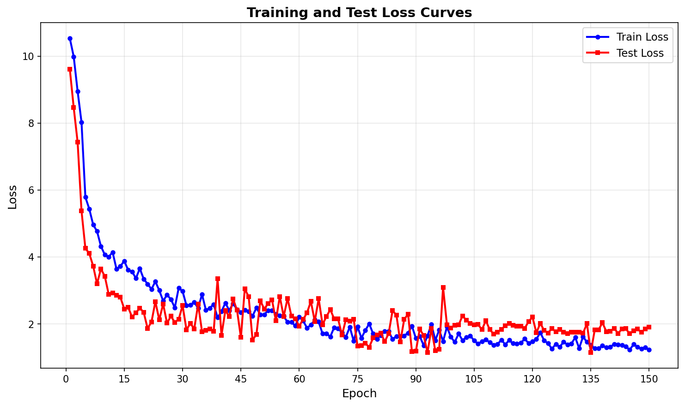
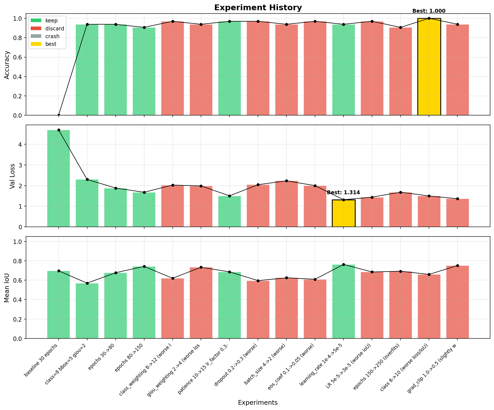

# autoDETR

Automated hyperparameter search for DETR object detection. An LLM autonomously iterates on training configuration — modifying, training, evaluating, and keeping or reverting each change — to maximize detection accuracy.

Inspired by [karpathy/autoresearch](https://github.com/karpathy/autoresearch).

## Results

After 49 automated experiments, the best model achieves:

| Metric | Value |
|--------|-------|
| Validation Loss | **0.999** |
| Classification Accuracy | **96.9%** |
| Mean IoU | **0.762** |

### Training Curves

<p align="center">
  
</p>

### Experiment History

<p align="center">
  
</p>

> Green = kept, Red = discarded, Yellow = best. Each bar is one experiment; the black line shows the running trend.

## Architecture

- **Backbone**: ResNet-50 (pretrained on ImageNet)
- **Transformer**: 1 encoder + 1 decoder layer, 8 attention heads, hidden dim 256
- **Detection head**: 25 object queries, 3 object classes + background
- **Loss**: Hungarian matching with weighted CE + L1 + GIoU

## Best Configuration (after 49 experiments)

| Parameter | Value |
|-----------|-------|
| Learning rate | 5e-5 |
| Optimizer | Adam |
| Scheduler | ReduceLROnPlateau (patience=15, factor=0.5) |
| Loss weights | class=8.0, bbox=6.0, giou=1.25 |
| Epochs | 150 |
| Batch size | 4 |
| Dropout | 0.2 |
| Dataset | 170 train / 32 test images |

## Commands

| Command | Description |
|---------|-------------|
| `autodetr-train` | Train model (auto-validates at end) |
| `autodetr-val --tag <name>` | Run validation and save visualization |
| `autodetr-eval` | Evaluation with visualization |
| `autodetr-plot` | Plot experiment history from results.tsv |
| `autodetr-collect` | Capture training images from webcam |

## Experiment Protocol

See [program.md](program.md) for the full autonomous experiment loop protocol. The key loop:

```
modify config.py → git commit → train → evaluate → keep or revert
```

Each experiment is a git commit. Improvements are kept; regressions are reverted with `git reset --hard HEAD~1`. Results are logged in `results.tsv` (not tracked by git).

## Project Structure

```
src/detr/
├── config.py        # Hyperparameters (editable)
├── train.py         # Training loop (editable)
├── validate.py      # Validation metrics
├── evaluate.py      # Interactive evaluation
├── model/           # DETR architecture (ResNet-50 + Transformer)
├── loss/            # Hungarian matching + CE + L1 + GIoU
├── data/            # Dataset and augmentations
└── tools/           # Data collection, plotting, utilities
```

## License

MIT
